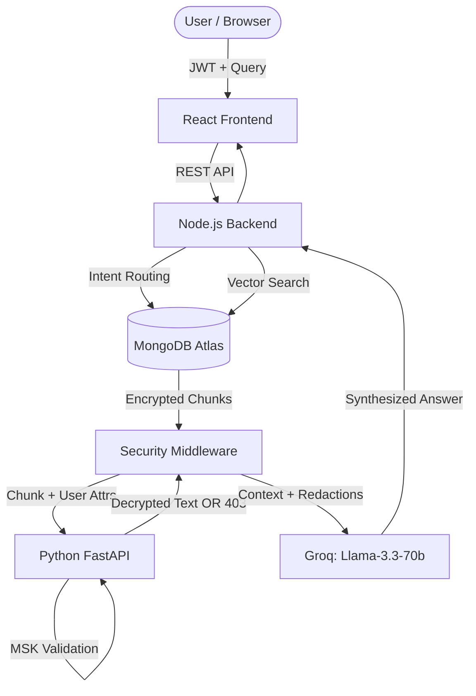

# 🔐 IIITA-Crypt


> **A Zero-Trust Retrieval-Augmented Generation (RAG) System for IIIT Allahabad.**

IIITA-Crypt is a highly secure, attribute-based access control (ABAC) system built for university environments. It allows students, faculty, wardens, and administrative staff to query a centralized knowledge base containing both public institutional rules and highly sensitive personal data (e.g., CGPA, salaries, fee status). 

Unlike traditional systems, **data is encrypted at rest using a simulated Ciphertext-Policy Attribute-Based Encryption (CP-ABE)** scheme. The language model only receives context data that the authenticated user has the cryptographic attributes to decrypt.

---

## 🌟 Key Features

* **Zero-Trust Architecture:** The Node.js application layer, MongoDB database, and LLM providers are treated as untrusted. Only the isolated Python encryption microservice holds the Master Secret Key (MSK).
* **Attribute-Based Access Control (ABAC):** Access is governed by boolean policies embedded directly into the ciphertext (e.g., `ADMIN OR DEAN OR HOSTEL-WARDEN-BH1 OR IIT2023001`).
* **Field-Level Sub-Profile Splitting:** A single user's data is split into multiple encrypted MongoDB documents (`academic`, `hostel`, `salary`, `directory`), each with different access policies.
* **Semantic & Intent Routing:** Uses regex-based intent classification for strict personal queries and falls back to **MongoDB Atlas Vector Search** (using OpenAI `text-embedding-3-small`) for institutional queries.
* **Tamper Detection:** Every ciphertext includes an HMAC-SHA256 signature and a pre-encryption `source_hash` to detect database tampering.
* **Prompt Injection Defense:** The system prompt strictly isolates retrieved text as "passive data," preventing malicious documents from hijacking the assistant's behavior.

---

## 🏗️ Architecture



### System Components
* **Node.js Backend:** Handles intent classification, MongoDB routing, and LLM synthesis orchestration.
* **Cryptography Microservice (Python):** Cryptographic isolation zone. Evaluates CP-ABE policies and manages the Master Secret Key (MSK).
* **React Frontend:** Role-adaptive UI, JWT management, and loading pipeline visualization.
* **Security Middleware (Node.js):** Enforces token TTL (15m), strict collection isolation, and pre-decryption policy gating.

---

## 🚀 Getting Started

### Prerequisites
* Node.js (v18+)
* Python 3.10+
* MongoDB Atlas Cluster (with Vector Search index named `vector_index`)
* API Keys: OpenAI (for embeddings) and Groq (for LLM inference)

### 1. Environment Setup

Clone the repository and set up your `.env` file in the root directory:
```bash
git clone https://github.com/karthikeyan2535/IIITA-Crypt.git
cd IIITA-Crypt
cp .env.template .env
```
*Fill in `MONGODB_URL`, `OPENAI_API_KEY`, `GROQ_API_KEY`, `JWT_SECRET`, and `MSK` in your `.env`.*

### 2. Start the Encryption Service
```bash
cd services/encryption
pip install -r requirements.txt
python -m uvicorn main:app --port 8000
```

### 3. Ingest Data & Seed Database
In a new terminal window:
```bash
cd backend
npm install
node scripts/seedUsers.js        # Hashes passwords and creates users
node scripts/ingestData.js       # Encrypts & embeds institutional docs
node scripts/ingestProfiles.js   # Splits, encrypts & embeds user profiles
```

### 4. Run the Backend & Frontend
```bash
# Start Backend (Port 3000)
cd backend
npm run dev

# Start Frontend (Port 5173) in a new terminal
cd frontend
npm install
npm run dev
```

---

## 🔐 Security & Hardening

This system incorporates robust defense mechanisms against common RAG and API vulnerabilities:
1. **Vector Collection Isolation:** The semantic search fallback explicitly locks `$vectorSearch` to the `documents` collection, ensuring prompt injection cannot scrape sensitive `userprofiles`.
2. **Fail-Closed Policy Evaluation:** Malformed CP-ABE policies or unhandled exceptions in the Python service default to a hard `403 Access Denied` rather than leaking structural error messages.
3. **Short TTL:** JWTs expire after 15 minutes, forcing re-authentication to capture dynamic attribute changes (e.g., a student changing hostels).
4. **LLM Containment:** The LLM is explicitly mandated to treat retrieved context as "passive data" and output a precise restricted string when it encounters `[REDACTED]` tags.

---

## 🧪 Testing

The repository includes a comprehensive test matrix validating all roles (Students, Faculty, HoD, Wardens, Dean) against personal, administrative, and public queries.

```bash
cd backend
node scripts/runTests.js        # Production hardening tests
node scripts/fullAccessTest.js  # Full ABAC Role x Query matrix (126 tests)
```

---

## 🤝 Contributing

See [CONTRIBUTING.md](./CONTRIBUTING.md) for setup instructions, branch naming conventions, and the PR checklist.

---

## 📄 Changelog

See [CHANGELOG.md](./CHANGELOG.md) for a full version history.
